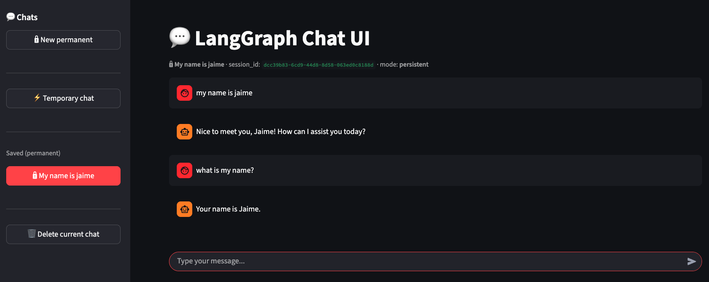

# 💬 LangGraph Memory Chatbot

<div align="center">

**A production-ready conversational AI backend built with LangGraph, featuring dual memory modes, tool integration, and a beautiful Streamlit UI**

[](https://www.python.org/)
[](https://www.langchain.com/)
[](https://github.com/langchain-ai/langgraph)
[](https://openai.com/)
[](https://fastapi.tiangolo.com/)
[](https://streamlit.io/)

*Perfect for learning LangGraph, conversational AI, and building production-ready chatbots*

</div>

---

## 🎯 What is This Project?

This is a **complete conversational AI application** that demonstrates how to build an intelligent chatbot system that:

- Maintains conversation context with dual memory modes
- Integrates external tools (Wikipedia, Weather)
- Uses LangGraph for sophisticated workflow orchestration
- Provides both REST API and web UI interfaces

**Perfect for students learning:**

- 🤖 LangGraph workflow orchestration
- 🔗 LangChain framework integration
- 💾 Memory management (temporary vs persistent)
- 🛠️ Tool integration and function calling
- 🌐 Building full-stack AI applications
- 🚀 Production-ready chatbot architecture

---

## ✨ Key Features

| Feature | Description |
|---------|-------------|
| 🔄 **Dual Memory Modes** | Temporary (in-memory) and Persistent (SQLite-backed) conversation history |
| 🛠️ **Tool Integration** | Wikipedia summaries and weather information via slash commands |
| 🧠 **Smart Context Management** | Automatic message trimming (1200 tokens) to prevent context overflow |
| 🚀 **FastAPI Backend** | RESTful API with Pydantic validation and session management |
| 🎨 **Streamlit UI** | Clean, intuitive chat interface with session management |
| 📊 **LangGraph Workflow** | Sophisticated state machine for conversation flow |
| 🔒 **Production Ready** | Modular architecture, error handling, and best practices |

---

## 🏗️ Architecture Overview

```
┌─────────────────┐
│  Streamlit UI   │  User types: "Hello!" or "/wiki Python"
└────────┬────────┘
         │ HTTP POST
         ▼
┌─────────────────────────────────────┐
│      FastAPI Backend                │
│  ┌───────────────────────────────┐  │
│  │  POST /chat                   │  │
│  │  - session_id                 │  │
│  │  - message                    │  │
│  │  - memory mode                │  │
│  └──────────────┬────────────────┘  │
└─────────────────┼────────────────────┘
                  │
                  ▼
┌─────────────────────────────────────┐
│      LangGraph Workflow             │
│  ┌───────────────────────────────┐  │
│  │  1. respond_node              │  │
│  │     - Process user input      │  │
│  │     - Trim message history    │  │
│  │     - Call LLM                │  │
│  └──────────────┬────────────────┘  │
│                 │                    │
│         ┌───────▼────────┐           │
│         │ needs_tools?   │           │
│         └───────┬────────┘           │
│                 │                    │
│    ┌────────────┴────────────┐       │
│    │                         │       │
│    ▼                         ▼       │
│  ┌──────────┐          ┌──────────┐ │
│  │ tools    │          │   END    │ │
│  │  node    │          │          │ │
│  └────┬─────┘          └──────────┘ │
│       │                              │
│       └──────────┐                   │
│                  ▼                   │
│         ┌─────────────────┐          │
│         │  Return to      │          │
│         │  respond_node   │          │
│         └─────────────────┘          │
└─────────────────┼────────────────────┘
                  │
                  ▼
         ┌────────────────┐
         │  Memory Store  │
         │  (Temporary or │
         │   Persistent)  │
         └────────────────┘
```

---

## 🛠️ Tech Stack

<div align="center">

| Category | Technology | Purpose |
|----------|-----------|---------|
| **🤖 AI/ML** | LangChain | Core LLM framework |
| | LangGraph | Workflow orchestration and state management |
| | OpenAI GPT-4o-mini | LLM for conversation and tool calling |
| **🌐 Backend** | FastAPI | REST API server |
| **💻 Frontend** | Streamlit | Interactive web interface |
| **💾 Storage** | SQLite | Persistent conversation storage |
| | MemorySaver | In-memory temporary storage |
| **⚙️ Tools** | uv | Fast Python package manager |
| | Python 3.10+ | Programming language |

</div>

---

## 📦 Project Structure

```
langgraph-memory-chatbot/
├── app/
│   ├── __init__.py
│   ├── config.py              # ⚙️ Configuration & environment variables
│   ├── schema.py              # 📋 Pydantic models (ChatRequest, ChatResponse)
│   ├── graph.py               # 🧠 LangGraph workflow definition
│   ├── main.py                # 🚀 FastAPI application
│   └── ui.py                  # 🎨 Streamlit interface
│
├── .data/                     # 📁 Data directory (created automatically)
│   └── memory.sqlite          # 💾 Persistent conversation storage
│
├── pyproject.toml             # 📋 Dependencies & project config
├── uv.lock                    # 🔒 Dependency lock file
├── .gitignore
└── README.md
```

---

## 🚀 Quick Start

### Prerequisites

- **Python 3.10+** installed
- **OpenAI API Key** ([Get one here](https://platform.openai.com/api-keys))
- **uv** package manager (we'll install it if needed)

### Installation Steps

#### 1️⃣ Install uv (if needed)

```bash
curl -LsSf https://astral.sh/uv/install.sh | sh
```

#### 2️⃣ Clone and Navigate

```bash
git clone https://github.com/JaimeLucena/langgraph-memory-chatbot.git
cd langgraph-memory-chatbot
```

#### 3️⃣ Install Dependencies

```bash
uv sync
```

This will create a virtual environment and install all required packages.

#### 4️⃣ Configure Environment

Create a `.env` file in the root directory:

```bash
OPENAI_API_KEY=sk-your-api-key-here
OPENAI_MODEL=gpt-4o-mini
SQLITE_PATH=.data/memory.sqlite
SYSTEM_PROMPT=You are a helpful and concise assistant.
```

> 💡 **Tip**: Never commit your `.env` file! It's already in `.gitignore`

#### 5️⃣ Create Data Directory

```bash
mkdir -p .data
```

---

## 🎮 Usage

### 1️⃣ Start the Backend

First, start the FastAPI backend server:

```bash
uv run uvicorn app.main:app --reload --port 8000
```

The API will be available at **http://localhost:8000**

> 💡 **Tip**: Keep this terminal open. The backend must be running for the frontend to work.

### 2️⃣ Start the Frontend (Streamlit UI)

In a **separate terminal**, launch the Streamlit web interface:

```bash
uv run streamlit run app/ui.py
```

The UI will open automatically in your browser at **http://localhost:8501**

**Features:**

- 💬 Clean chat interface for conversations
- 🔒 **Persistent chats**: Saved conversations with SQLite backend
- ⚡ **Temporary chats**: In-memory conversations (lost on refresh)
- 🛠️ **Tool commands**: Use `/wiki <topic>` or `/weather <city>`
- 📝 **Chat history**: View and manage multiple conversation sessions
- 🎨 **Modern UI**: Intuitive interface with session management

### 3️⃣ Using the REST API Directly (Optional)

If you prefer to interact with the API directly without the UI, you can use the REST endpoints.

**Interactive API Docs:** Visit **http://localhost:8000/docs** for Swagger UI

#### API Endpoints

| Method | Endpoint | Description |
|--------|----------|-------------|
| `POST` | `/chat` | Send a message and receive a response |

#### Example API Request

```bash
curl -X POST "http://localhost:8000/chat" \
  -H "Content-Type: application/json" \
  -d '{
    "session_id": "user-123",
    "message": "Hello! How are you?",
    "memory": "persistent"
  }'
```

**Response:**

```json
{
  "session_id": "user-123",
  "reply": "I'm doing well, thank you! How can I help you today?",
  "mode": "persistent",
  "tokens_input": null,
  "tokens_output": null
}
```

---

## 💡 Example Interactions

Try these interactions to see the chatbot in action:

### Basic Conversations

- `"Hello! How are you?"`
- `"What can you help me with?"`
- `"Tell me a joke"`
- `"Explain quantum computing in simple terms"`

### Tool Commands

#### Wikipedia Tool

- `/wiki Python programming`
- `/wiki Albert Einstein`
- `/wiki Machine Learning`

#### Weather Tool

- `/weather Madrid`
- `/weather New York`
- `/weather Tokyo`

### Memory Testing

1. **Start a persistent chat** and ask: `"My name is Alice"`
2. **In the same session**, ask: `"What's my name?"`
3. The bot should remember: `"Your name is Alice"`

4. **Start a temporary chat** and have a conversation
5. **Refresh the page** - the temporary chat is lost
6. **Persistent chats** survive page refreshes and restarts

---

## 🧠 How LangGraph Works Here

### Step-by-Step Process

1. **User Input** → Message sent to FastAPI endpoint

   ```
   POST /chat
   {
     "session_id": "user-123",
     "message": "/wiki Python",
     "memory": "persistent"
   }
   ```

2. **Graph Invocation** → LangGraph processes the message

   ```
   - Load conversation history from checkpointer (if persistent)
   - Trim messages to fit token limit (1200 tokens)
   - Route to respond_node
   ```

3. **LLM Processing** → Model decides on tool usage

   ```
   - If message starts with "/wiki" or "/weather" → bind tools
   - Otherwise → regular conversation
   - Generate response or tool calls
   ```

4. **Tool Execution** (if needed)

   ```
   - Execute wiki_summary("Python") or get_weather("city")
   - Return tool results to LLM
   - LLM formats final answer
   ```

5. **State Persistence** → Save conversation state

   ```
   - Temporary: In-memory (MemorySaver)
   - Persistent: SQLite database
   ```

6. **Response** → Return formatted answer to user

   ```
   {
     "reply": "Python is a high-level programming language...",
     "mode": "persistent"
   }
   ```

### Key Components

- **`app/graph.py`**: Core LangGraph workflow
  - `ChatState`: TypedDict for conversation state
  - `respond_node`: Main LLM interaction node
  - `tools_node`: Tool execution node
  - `needs_tools`: Routing logic for tool usage
  - Message trimming to prevent context overflow

- **`app/main.py`**: FastAPI application
  - Dual graph instances (temporary/persistent)
  - Session-based conversation management
  - SQLite checkpointer lifecycle

- **`app/schema.py`**: Pydantic models
  - `ChatRequest`: Input validation
  - `ChatResponse`: Output formatting
  - `MemoryMode`: Type-safe memory mode selection

---

## 📊 Memory Modes Explained

### Temporary Memory (MemorySaver)

- **Storage**: In-memory (RAM)
- **Persistence**: Lost on server restart
- **Use Case**: Quick, ephemeral conversations
- **Performance**: Faster (no disk I/O)
- **Session**: Each `session_id` maintains separate state

### Persistent Memory (SqliteSaver)

- **Storage**: SQLite database file
- **Persistence**: Survives server restarts
- **Use Case**: Long-term conversations, user history
- **Performance**: Slightly slower (disk I/O)
- **Session**: Each `session_id` maintains separate state across restarts

### Choosing the Right Mode

| Scenario | Recommended Mode |
|----------|-----------------|
| Quick questions | `temporary` |
| Long conversations | `persistent` |
| User accounts | `persistent` |
| Testing/development | `temporary` |
| Production | `persistent` |

---

## 🎓 Learning Objectives

By exploring this project, you'll learn:

✅ **LangGraph Fundamentals**

- Building state machines for conversations
- Node-based workflow orchestration
- Conditional routing and decision making
- State persistence and checkpoints

✅ **Memory Management**

- Temporary vs persistent storage
- Conversation state management
- Session-based isolation
- Message history trimming

✅ **Tool Integration**

- Function calling with LLMs
- External API integration
- Tool result processing
- Slash command patterns

✅ **Full-Stack AI Apps**

- Building REST APIs for AI services
- Creating interactive UIs
- Managing state and sessions
- Error handling and validation

✅ **Best Practices**

- Modular code organization
- Environment configuration
- Type hints and Pydantic models
- Production-ready architecture

---

## 🔧 Development

### Running Tests

```bash
uv run pytest
```

### Code Formatting

```bash
uv run ruff format .
uv run ruff check .
```

### Project Scripts

You can create convenience scripts:

```bash
# run_backend.sh
#!/bin/bash
uv run uvicorn app.main:app --reload --port 8000

# run_ui.sh
#!/bin/bash
uv run streamlit run app/ui.py
```

---

## 🛠️ Configuration

All configuration is managed through environment variables in `.env`:

| Variable | Description | Default |
|----------|-------------|---------|
| `OPENAI_API_KEY` | Your OpenAI API key | **Required** |
| `OPENAI_MODEL` | Model to use | `gpt-4o-mini` |
| `SQLITE_PATH` | Path to SQLite database | `.data/memory.sqlite` |
| `SYSTEM_PROMPT` | System prompt for the AI | `"You are a helpful and concise assistant."` |

---

## 🤔 Common Questions

**Q: Why two memory modes?**  

A: Temporary mode is faster and useful for testing. Persistent mode is essential for production where conversations need to survive restarts.

**Q: Can I use a different LLM?**  

A: Yes! LangChain supports many providers (Anthropic, Azure, etc.). Just change the LLM initialization in `app/graph.py` and update `config.py`.

**Q: How do I add more tools?**  

A: Add new `@tool` decorated functions in `app/graph.py`, add them to the `TOOLS` list, and update the routing logic in `user_requested_tools()`.

**Q: Is this production-ready?**  

A: This is a solid foundation! For production, add authentication, rate limiting, logging, monitoring, and consider using PostgreSQL instead of SQLite for scale.

**Q: How does message trimming work?**  

A: The `trim_messages` utility keeps the most recent messages that fit within 1200 tokens, ensuring the context window isn't exceeded while preserving recent conversation context.

---

## 📚 Additional Resources

- [LangGraph Documentation](https://langchain-ai.github.io/langgraph/)
- [LangChain Documentation](https://python.langchain.com/)
- [FastAPI Documentation](https://fastapi.tiangolo.com/)
- [Streamlit Documentation](https://docs.streamlit.io/)
- [OpenAI API Reference](https://platform.openai.com/docs/)

---

## 📝 License

MIT License - see [LICENSE](LICENSE) file for details

---

## 🙏 Acknowledgments

Built with ❤️ for students learning AI and conversational systems.

**Happy Learning! 🚀**

---

<div align="center">

**Made with** ❤️ **for the AI learning community**

⭐ **Star this repo if you found it helpful!**

[Project Link](https://github.com/JaimeLucena/langgraph-memory-chatbot)

</div>
